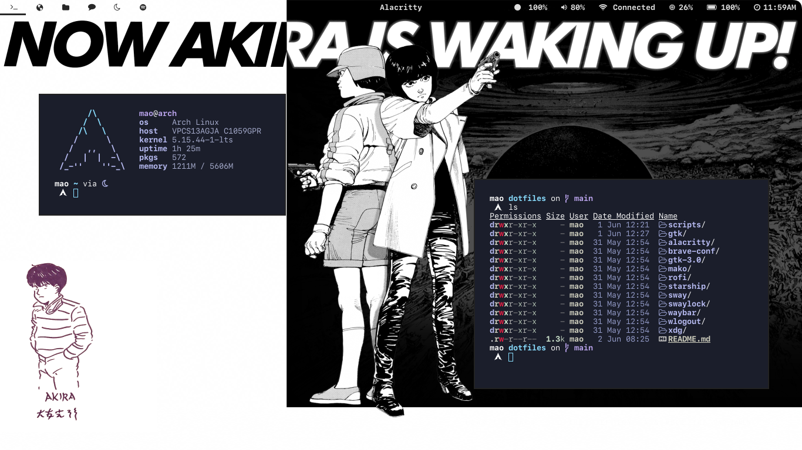

<p align="center">
<samp><b>dotfiles (WIP)</b></samp>


<samp>Dependencies</samp>

<p align="center">
<sub><samp>
&nbsp;WM: sway<br>
Terminal: alacritty<br>
&nbsp;&nbsp;&nbsp;Shell: zsh, bash<br>
&nbsp;&nbsp;&nbsp;&nbsp;&nbsp;&nbsp;&nbsp;&nbsp;&nbsp;&nbsp;&nbsp;&nbsp;&nbsp;&nbsp;&nbsp;&nbsp;&nbsp;&nbsp;&nbsp;&nbsp;&nbsp;&nbsp;&nbsp;&nbsp;Font: <a href="https://github.com/shaunsingh/SFMono-Nerd-Font-Ligaturized">SF Mono Nerd Font Ligaturized<a><br>
Notification: mako&nbsp;&nbsp;&nbsp;&nbsp;&nbsp;&nbsp;&nbsp;&nbsp;&nbsp;<br>
Text Editor: neovim&nbsp;&nbsp;&nbsp;&nbsp;&nbsp;&nbsp;<br>
PDF Viewer: zathura&nbsp;&nbsp;&nbsp;&nbsp;<br>
&nbsp;File Manager: ranger, thunar<br>
&nbsp;&nbsp;Web Browser: firefox, brave<br>
Status Bar: waybar&nbsp;&nbsp;&nbsp;&nbsp;&nbsp;<br>
Launcher: rofi&nbsp;&nbsp;&nbsp;&nbsp;&nbsp;<br>
</samp></sub>


##### Usage

`git`

```ts
// clone the repository
git clone https://github.com/maoescobillo/dotfiles.git
```

`stow`

```ts
// stow to install
stow zsh 
```
<br>
<br>
<p align="center"><samp>Preview</samp></p>

<p align="center">


